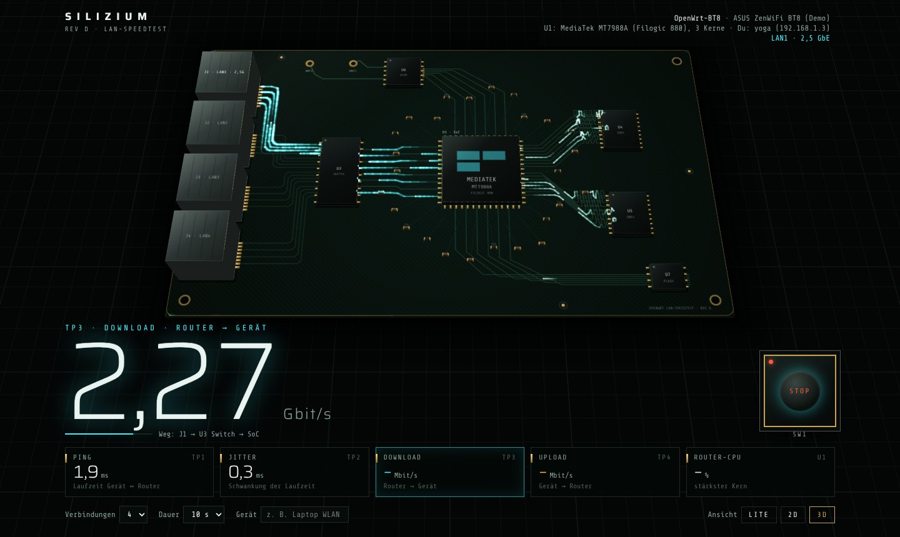
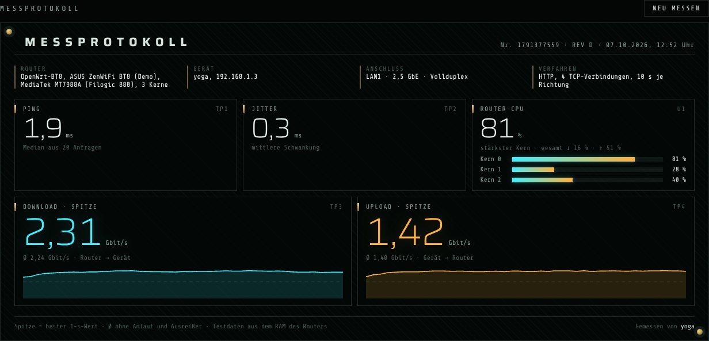
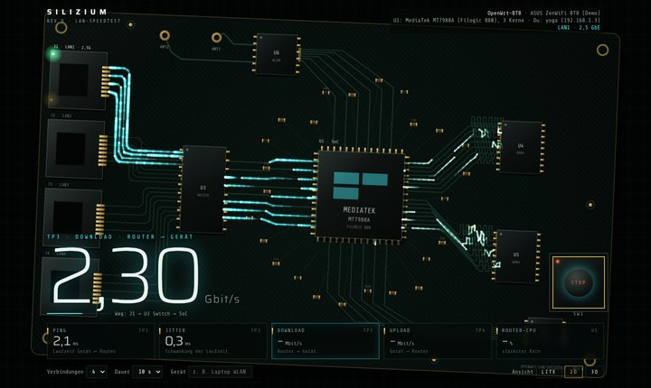
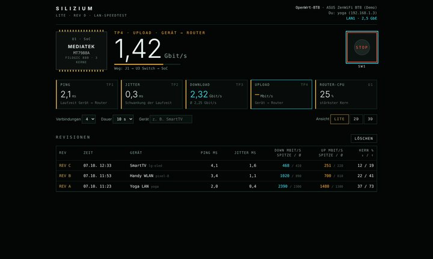

# Silizium · der LAN-Speedtest, der auf deinem OpenWrt-Router wohnt



Dein Router hat einen Webserver. Dein Router hat einen Prozessor. Dein Router hat jetzt auch einen Speedtest,
der dir zeigt, wie schnell es zwischen **deinem Gerät und dem Router** wirklich geht, per Kabel oder WLAN.
Und damit das nicht langweilig aussieht, rasen die Daten dabei als Lichtimpulse über eine Platine,
genau über die Buchse, in der dein Kabel steckt.

Keine App, kein Docker, kein NGINX, keine Cloud. Nur uhttpd, das sowieso schon LuCI ausliefert, plus `uhttpd-mod-ucode`.

> **Ehrlich gesagt: zu 99 % Vibe-Coding.** Code, Designs und Texte hat eine KI geschrieben (Claude Code).
> Der Mensch hat Wünsche geäußert, auf dem echten Router gemessen, Kaffee getrunken, gestaunt
> und gelegentlich gesagt: „Die Kamera soll nicht so nah ran.“
> Das restliche Prozent? Debugging am Gerät und die KI wieder einfangen, wenn sie mal abgebogen ist.
> Wird gern unterschätzt. ;)

## Was misst das Ding?

> ⚠️ **Nicht deine Internetleitung.** Gemessen wird Browser ↔ Router im eigenen Netz.
> Wer wissen will, ob der Provider schummelt, ist hier falsch. Wer wissen will, ob das WLAN im Schlafzimmer
> oder das 15 Jahre alte Patchkabel schuld ist: willkommen!

- **Ping und Jitter** zum Router
- **Download und Upload**, jeweils Spitze (bester 1-s-Wert) und Durchschnitt
- **Router-CPU je Kern**, falls nicht das Netz, sondern der Router selbst schnauft
- **Anschluss**: An welchem LAN-Port du hängst und mit wie viel Gbit, oder welches WLAN-Band mit welchem Signal. Das verrät der Router selbst, der Browser weiß davon nichts.
- **Verlauf** aller Messungen mit Hostname aus der DHCP-Liste, damit „Handy Küche“ und „Laptop Balkon“ sich vergleichen lassen

Am Ende gibt es ein Messprotokoll. Ganz ohne Stempel, versprochen.



## Drei Ansichten, eine Adresse

Einfach `http://<router-ip>/speedtest/` öffnen. Die Seite schaut sich deinen Browser an und entscheidet,
wie viel Show er verträgt:

| | Ansicht | Für wen | Was passiert |
|---|---|---|---|
| 🛸 | **3D** (`silizium3d.html`) | Geräte mit ordentlicher Grafik | Platine als 3D-Modell (WebGL). Im Leerlauf fliegt eine Drohne darüber, beim Messen geht's in die Draufsicht. |
| 🖥️ | **2D** (`silizium2d.html`) | der solide Mittelbau | animierte Platine, Kamera zoomt und dreht sich ein bisschen |
| 🥔 | **Lite** (`silizium-lite.html`) | der SmartTV von 2016, das Handy aus der Schublade, „Bewegung reduzieren“ | keine Animation, 25 KB, misst genauso genau |

Unten rechts kann man jederzeit zwischen **Lite · 2D · 3D** wechseln, der Browser merkt sich die Wahl.
Und falls ein Gerät 3D bestellt, aber nicht verdauen kann, schaltet die Seite selbst auf 2D zurück.

| 2D | Lite |
|---|---|
|  |  |

Schriften sind eingebettet, alles läuft komplett offline.

## Bonus: das Designlabor 🧪

Bevor Silizium gewonnen hat, sind gut 40 Entwürfe entstanden, und keiner wurde weggeworfen.
Alle liegen in `speedtest/` und sind voll funktionsfähig. Ohne Router laufen sie im **Demo-Modus** mit simulierten Werten.
Zum Reinschauen einfach anklicken (die Links laufen über [raw.githack.com](https://raw.githack.com), einen freien Dienst,
der Dateien aus GitHub direkt als Webseite ausliefert) oder das Repo klonen und die HTML-Datei im Browser öffnen:

**Hommagen** (bewusst ohne geschützte Namen, Logos oder Zitate, man erkennt sie trotzdem):

| Datei | angelehnt an | |
|---|---|---|
| [`testkammer.html`](https://raw.githack.com/TechnoHoschi/openspeedtest-openwrt/main/speedtest/testkammer.html) | Portal | weiße Testkammer, eine KI namens EVA-7 und ein Zertifikat. Kuchen gibt's keinen. |
| [`portalsprung.html`](https://raw.githack.com/TechnoHoschi/openspeedtest-openwrt/main/speedtest/portalsprung.html) | Portal | endloser Fall durch Portale |
| [`abspann.html`](https://raw.githack.com/TechnoHoschi/openspeedtest-openwrt/main/speedtest/abspann.html) | Portal | Bernstein-Terminal, die KI dichtet ein Lied über deine Messung |
| [`leuchtwald.html`](https://raw.githack.com/TechnoHoschi/openspeedtest-openwrt/main/speedtest/leuchtwald.html) | Avatar | biolumineszenter Wald |
| [`lichtgitter.html`](https://raw.githack.com/TechnoHoschi/openspeedtest-openwrt/main/speedtest/lichtgitter.html) | Tron | Lichtgitter |
| [`coderegen.html`](https://raw.githack.com/TechnoHoschi/openspeedtest-openwrt/main/speedtest/coderegen.html) | Matrix | grüner Code-Regen |
| [`sternentor.html`](https://raw.githack.com/TechnoHoschi/openspeedtest-openwrt/main/speedtest/sternentor.html) | Stargate | Tor wählt an |
| [`horizont.html`](https://raw.githack.com/TechnoHoschi/openspeedtest-openwrt/main/speedtest/horizont.html) | Interstellar | Ereignishorizont |
| [`traumebene.html`](https://raw.githack.com/TechnoHoschi/openspeedtest-openwrt/main/speedtest/traumebene.html) | Inception | Traumebenen |
| [`oedland.html`](https://raw.githack.com/TechnoHoschi/openspeedtest-openwrt/main/speedtest/oedland.html) | Mad Max | Ödland |
| [`sperrzone.html`](https://raw.githack.com/TechnoHoschi/openspeedtest-openwrt/main/speedtest/sperrzone.html) | Resident Evil | Sperrzone |
| [`inferno.html`](https://raw.githack.com/TechnoHoschi/openspeedtest-openwrt/main/speedtest/inferno.html) | Doom | Inferno |
| [`bunker.html`](https://raw.githack.com/TechnoHoschi/openspeedtest-openwrt/main/speedtest/bunker.html) | Fallout | Bunker-Terminal |
| [`bestiarium.html`](https://raw.githack.com/TechnoHoschi/openspeedtest-openwrt/main/speedtest/bestiarium.html) | The Witcher | Bestiarium |
| [`huepfwelt.html`](https://raw.githack.com/TechnoHoschi/openspeedtest-openwrt/main/speedtest/huepfwelt.html) | Giana Sisters | Jump 'n' Run |
| [`absurd.html`](https://raw.githack.com/TechnoHoschi/openspeedtest-openwrt/main/speedtest/absurd.html) | Spaceballs | Weltraum-Parodie, Geschwindigkeit jenseits von allem |

**Hightech und Sci-Fi:** [Fusionskern](https://raw.githack.com/TechnoHoschi/openspeedtest-openwrt/main/speedtest/fusionskern.html) (der Router als Reaktor) ·
[Beschleuniger](https://raw.githack.com/TechnoHoschi/openspeedtest-openwrt/main/speedtest/beschleuniger.html) (jeder Ping eine Teilchenkollision) ·
[Netzatlas](https://raw.githack.com/TechnoHoschi/openspeedtest-openwrt/main/speedtest/netzatlas.html) (dein Heimnetz als 3D-Sternkarte) ·
[Datenrelief](https://raw.githack.com/TechnoHoschi/openspeedtest-openwrt/main/speedtest/datenrelief.html) (die Messung als Gebirge) ·
[Warp](https://raw.githack.com/TechnoHoschi/openspeedtest-openwrt/main/speedtest/warp.html) ·
[Brücke](https://raw.githack.com/TechnoHoschi/openspeedtest-openwrt/main/speedtest/bruecke.html) ·
[Fraktal](https://raw.githack.com/TechnoHoschi/openspeedtest-openwrt/main/speedtest/fraktal.html) ·
[Silizium 3D mit drei Kamerafahrten](https://raw.githack.com/TechnoHoschi/openspeedtest-openwrt/main/speedtest/silizium3d-kameras.html)

**Retro und Analog:** [Tacho](https://raw.githack.com/TechnoHoschi/openspeedtest-openwrt/main/speedtest/tacho.html) ·
[Röhre](https://raw.githack.com/TechnoHoschi/openspeedtest-openwrt/main/speedtest/roehre.html) (60er-Labor mit Nixie-Röhren) ·
[Fallblatt](https://raw.githack.com/TechnoHoschi/openspeedtest-openwrt/main/speedtest/fallblatt.html) (Bahnhofstafel) ·
[Vinyl](https://raw.githack.com/TechnoHoschi/openspeedtest-openwrt/main/speedtest/vinyl.html) ·
[Arcade](https://raw.githack.com/TechnoHoschi/openspeedtest-openwrt/main/speedtest/arcade.html) ·
[Frontblende](https://raw.githack.com/TechnoHoschi/openspeedtest-openwrt/main/speedtest/frontblende.html) ·
[Cockpit](https://raw.githack.com/TechnoHoschi/openspeedtest-openwrt/main/speedtest/cockpit.html)

**Kunst und Natur:** [Bauhaus](https://raw.githack.com/TechnoHoschi/openspeedtest-openwrt/main/speedtest/bauhaus.html) ·
[Datengarten](https://raw.githack.com/TechnoHoschi/openspeedtest-openwrt/main/speedtest/garten.html) ·
[Datensand](https://raw.githack.com/TechnoHoschi/openspeedtest-openwrt/main/speedtest/sand.html) ·
[Klar](https://raw.githack.com/TechnoHoschi/openspeedtest-openwrt/main/speedtest/klar.html)

**Für Netzwerker:** [Netzplan](https://raw.githack.com/TechnoHoschi/openspeedtest-openwrt/main/speedtest/netzplan.html) ·
[Engpass](https://raw.githack.com/TechnoHoschi/openspeedtest-openwrt/main/speedtest/engpass.html) ·
[Mitschnitt](https://raw.githack.com/TechnoHoschi/openspeedtest-openwrt/main/speedtest/mitschnitt.html) ·
[Funkfeld](https://raw.githack.com/TechnoHoschi/openspeedtest-openwrt/main/speedtest/funkfeld.html) ·
[Statusseite](https://raw.githack.com/TechnoHoschi/openspeedtest-openwrt/main/speedtest/statusseite.html) (sieht aus wie LuCI, mit echtem Logo direkt vom Router)

Ein paar der älteren Entwürfe laden ihre Schriften noch von Google Fonts. Offline sehen sie dann etwas schlichter aus.

## Installation

Voraussetzungen: OpenWrt 25.12 (getestet auf Asus ZenWiFi BT8), ab Dual-Core und 128 MB RAM,
und `uhttpd-mod-ucode` (mit LuCI meist schon da, sonst `apk add uhttpd-mod-ucode`).
Ein GL.iNet von 2017 mit 64 MB RAM wird keine Freude haben, und du auch nicht.

1. Den Ordner `speedtest/` per WinSCP (Protokoll SCP) nach `/www/speedtest` kopieren.
   Mit Kommandozeilen-`scp` die Option `-O` verwenden, dropbear kann kein SFTP.
2. Per SSH: `sh /www/speedtest/install.sh`
3. Im Browser: `http://<router-ip>/speedtest/`

Wichtig: **http://**, nicht https. HTTPS frisst Router-CPU, und dann misst du die Verschlüsselung statt des Netzes.
Ist `redirect_https` aktiv, sagt `install.sh` Bescheid.

`install.sh` trägt den ucode-Handler in `/etc/config/uhttpd` ein (`ucode_prefix /speedtest-api`), setzt `max_requests` auf mindestens 16
und startet uhttpd neu. Läuft uhttpd danach nicht, stellt das Skript sofort die alte Konfiguration wieder her.
LuCI bleibt also erreichbar, auch wenn etwas schiefgeht. Darauf haben wir geachtet, nachdem wir LuCI einmal versehentlich abgeschossen hatten.

<details><summary>Dasselbe von Hand (ohne Sicherheitsnetz)</summary>

```sh
head -c 2 /www/speedtest/api.uc        # muss "{%" ausgeben, sonst startet uhttpd nicht
cp /etc/config/uhttpd /tmp/uhttpd.bak
uci add_list uhttpd.main.ucode_prefix='/speedtest-api=/www/speedtest/api.uc'
uci set uhttpd.main.max_requests=16
uci commit uhttpd && service uhttpd restart
pidof uhttpd || { cp /tmp/uhttpd.bak /etc/config/uhttpd; service uhttpd restart; }
```
</details>

**Aktualisieren:** neue Dateien nach `/www/speedtest` kopieren. Hat sich `api.uc` geändert, danach `service uhttpd restart`
(und vorher kurz `head -c 2 /www/speedtest/api.uc` prüfen, ob `{%` herauskommt).

**Entfernen:** `sh /www/speedtest/uninstall.sh` räumt uhttpd auf, gibt den RAM frei und löscht den Ordner. Keine Reste, kein Groll.

**Backup:** `/www/speedtest` und `/etc/config/uhttpd` sichern.

## Unter der Haube

| Teil | Umsetzung | Warum |
|---|---|---|
| Download | 64-MB-Datei in `/tmp/speedtest` (RAM), per Bind-Mount unter `/www/speedtest/data/` eingeblendet, uhttpd liefert direkt aus | schnellste Variante und schont den Flash |
| Upload | ucode-Handler `api.uc` in uhttpd, liest und verwirft die Daten | gut doppelt so schnell wie Shell-CGI |
| Ping/Jitter | `ping.txt`, 20 Abfragen, Median | kein Script-Overhead |
| Messkern | `engine.js`, ES5 ohne Abhängigkeiten, für alle Ansichten; ohne Router läuft ein Demo-Modus | ein Messkern, viele Gesichter |
| Router-CPU | `/speedtest-api/cpu` liest `/proc/stat` am Anfang und Ende jeder Richtung | stört die Messung nicht |
| Anschluss | `/speedtest-api/link`: IP → MAC (ARP) → Bridge-Port → Port-Speed; bei WLAN Band, Kanal, Signal und Linkrate über iwinfo | die Platine zeigt den echten Datenweg |
| Router-Info | `/speedtest-api/info`: Hostname, Modell, Kerne, SoC aus dem Device-Tree (z. B. MediaTek MT7988A, Filogic 880) | steht als Aufdruck auf dem Chip |
| Verlauf | `/tmp/speedtest-history.json` (RAM), max. 200 Einträge | nach einem Neustart weg, dafür kein Flash-Verschleiß |

Gemessen auf dem Asus BT8 (3 Kerne, PC per 2,5 GbE, Messkit in `bench/`):

| | 1 Verbindung | 4 Verbindungen |
|---|---|---|
| Download, Datei im RAM | 1019 Mbit/s | 1842 Mbit/s |
| Upload, ucode | 599 Mbit/s | 1142 Mbit/s |
| Upload, Shell-CGI (der alte Weg) | 319 Mbit/s | 404 Mbit/s |
| iperf3 -P4 zum Vergleich | | 2320 / 1710 Mbit/s |

Im Browser schafft die Seite auf dem BT8 bis 2,39 Gbit/s Download und 1,0 bis 1,4 Gbit/s Upload bei 2 ms Ping.

## Gut zu wissen

- **Ping:** uhttpd in OpenWrt 25.12 setzt kein `TCP_NODELAY` und hält kleine Antworten dadurch ~40 ms fest
  (behoben in uhttpd [82b4c79](https://github.com/openwrt/uhttpd/commit/82b4c79), in 25.12 noch nicht drin).
  Deshalb misst die Seite die Zeit bis zum ersten Antwort-Byte, und der Upload schickt große 32-MB-Stücke.
- **Ergebnis:** Groß steht die Spitze (bester gleitender 1-s-Wert, derselbe wie in der Live-Anzeige). Darunter steht der Durchschnitt
  ohne Anlauf, ohne die langsamsten 30 % und die schnellsten 10 %.
- **Ein CPU-Kern bei fast 100 %:** Dann ist der Router selbst die Grenze, nicht das Netz. Beim Speedtest ist der Router die Gegenstelle
  und muss jedes Paket selbst anfassen. Verkehr, der nur durch ihn durchläuft, nutzt die Hardware-Beschleunigung und ist meist schneller.
- **iperf3** bleibt die Referenz fürs Netz, nur spricht kein Browser dieses Protokoll. Wer es dauerhaft laufen lässt: mit `-B <lan-ip>` ans LAN binden.
- **Diagnose:** `diag.html` vergleicht verschiedene Messmethoden im Browser, falls Werte komisch aussehen.
- Ältere Browser ohne Fetch-Streams messen den Download per XHR in 32-MB-Häppchen, damit ihnen nicht der Speicher ausgeht.

## Danke! 🙏

Dieses Repo hat als Fork von **[OpenSpeedTest™](https://openspeedtest.com)** angefangen
([github.com/openspeedtest/Speed-Test](https://github.com/openspeedtest/Speed-Test)).
OpenSpeedTest hat gezeigt, wie gut ein Speedtest nur mit Bordmitteln des Browsers funktioniert, und war der Startschuss für alles hier.
**Ganz herzlichen Dank an Vishnu und das OpenSpeedTest-Team** sowie an alle, die dort mitgewirkt haben!

Inzwischen ist kein Stein mehr auf dem anderen. Der alte Fork mit den Shell-CGIs liegt aber weiter in der Git-Historie.

Danke außerdem an das **OpenWrt**-Projekt für uhttpd, ucode, LuCI und iwinfo, ohne die hier gar nichts liefe,
und an die Gestalter der Schriften **Saira** (Omnibus-Type) und **Share Tech Mono** (Carrois Apostrophe), beide unter der SIL Open Font License.

## Lizenz

MIT, siehe [LICENSE](LICENSE). Die eingebetteten Schriften stehen unter der SIL Open Font License 1.1.
